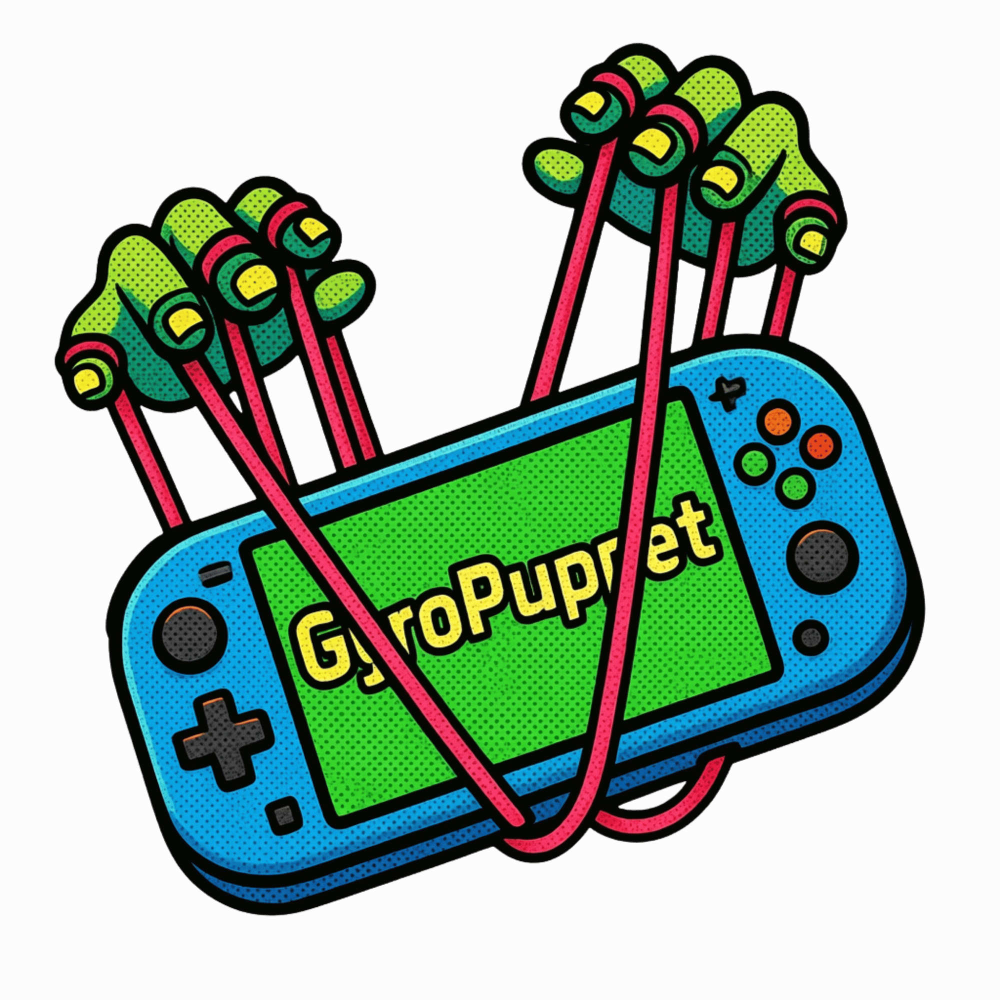
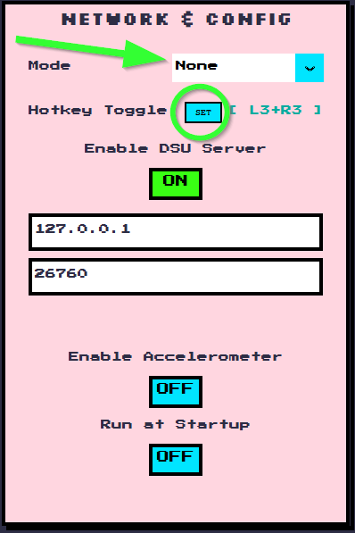
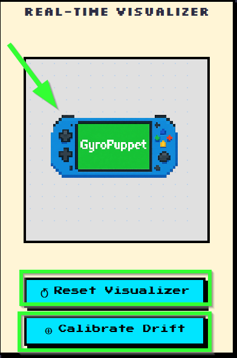
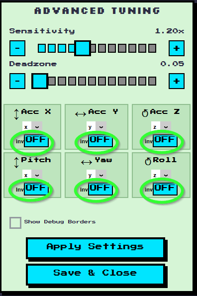
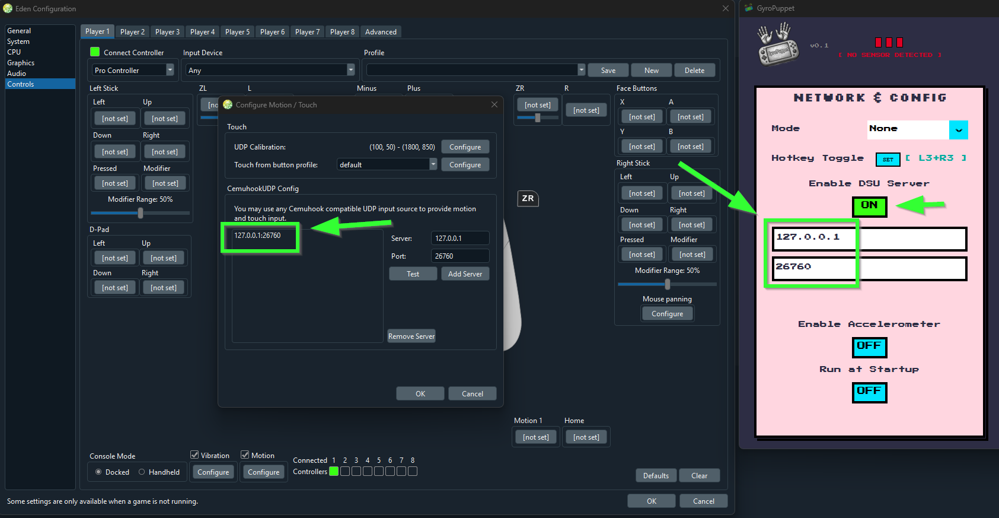

#  GyroPuppet

### [📥 Download GyroPuppet Setup](https://github.com/Halim1410/gyropuppet/releases/latest/download/GyroPuppet_v0.1_Setup.exe)

Unlock native-grade motion controls on the MSI Claw, Legion Go, and other Windows handhelds. Featuring a retro-styled diagnostic UI, DSU server integration, and zero-dependency hardware injection for a seamless gaming experience.

GyroPuppet is a high-performance, low-latency motion control bridge for Windows handheld gaming PCs. It translates your device's internal gyrometer data into precise Mouse emulation, Xbox Right Stick input, or standard DSU server data for seamless emulator integration.

Say goodbye to clunky thumbstick aiming in your favorite Action-Platformers and Metroidvanias, and say hello to native-grade motion controls!

> ⚠️ **Hardware Note:** This tool was explicitly tested only on the MSI Claw 8 AI+. While it uses standard Windows sensor APIs and might work on other handhelds, the Claw is the only device so far.

---

## 📸 Feature Breakdown

### 1. Network & Config (The Command Center)

* **Operation Mode:** Instantly switch between "Mouse Emulation", "Xbox Right Stick", or "None" if you just want to pass data to an emulator.
* **Hotkey Toggle:** Click `SET` and press any combination of controller buttons (like `L3 + R3`) to create a global kill-switch. Perfect for pausing the gyro when you need to quickly navigate a menu!
* **DSU Server:** Flip this `ON` to broadcast your gyro data locally. (Default `127.0.0.1:26760`).
* **Run at Startup:** For the true "factory-installed" feel, let GyroPuppet boot silently in the background when Windows starts.

### 2. The Real-Time Visualizer

* **The Puppet:** Move your MSI Claw, and the on-screen pixel art handheld moves with it in real-time. This is your immediate diagnostic tool to ensure Windows is actually reading your hardware sensors.
* **Reset Visualizer:** Sometimes the on-screen puppet gets a little dizzy or out of sync visually. Smack this button to instantly snap the 3D model back to center without messing with your active hardware calibration.
* **Calibrate Drift:** If your aim starts pulling to the left after an intense gaming session, set your Claw down on a flat surface and click this button to instantly zero out the hardware sensors.

### 3. Advanced Tuning

* **Sensitivity & Deadzone:** Dial in your exact preferences using the block sliders. High sensitivity for fast 3D platformers, or lower sensitivity with a tight deadzone for precision aiming.
* **Axis Mapping & Inversion:** Handheld sensors can be weird. If moving your device UP makes the camera look DOWN, just flip the `Inv` switch on the Pitch axis. Total control over X/Y/Z mapping.

---

## 🕹️ Emulator Setup: Eden & Ryujinx

GyroPuppet acts as a native DSU (Cemuhook) server, making it the "gold standard" for feeding motion data directly into emulators without messy third-party plugins.

*(Insert a screenshot here showing the Eden Emulator's controller settings menu side-by-side with GyroPuppet. Draw an arrow showing the IP/Port matching between the two apps)*

**How to connect to Eden:**
1. Open **GyroPuppet** and ensure `Enable DSU Server` is **ON**.
2. Note your IP and Port (Usually `127.0.0.1` and `26760`).
3. Open **Eden Emulator** and navigate to the Controller/Input Settings.
4. Look for the "Motion" or "DSU Server" section.
5. Enter the matching IP and Port.
6. Shake your Claw—if Eden shows motion activity, you are ready to play!

---

##  Support the Developer

If GyroPuppet made your handheld experience better, consider dropping a tip in the jar! Just click the **[ SUPPORT DEV ☕ ]** button in the top right of the app, or use the link below:

**[Support the Project on Ko-fi!](https://ko-fi.com/halim1410)**

*Built with Python, CustomTkinter, and a lot of iterations and testing.*
